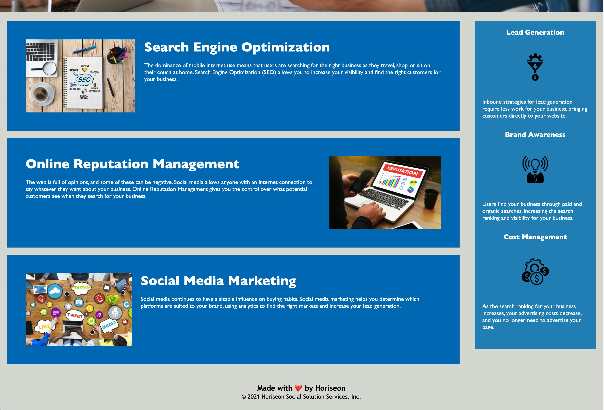

# semantic-tagging
Boot Camp HW #1

## Changelog (Description of completed changes)
- Added semantic HTML elements in place of div tags to optimize accessibility and SEO.
- Followed a logical structure independent of styling and positioning.
- Added accessible alt attributes to HMTL image tags.
- Heading attributes fall in sequential order.
- Adjusted title to more precisely describe web page.

## Screenshots

## Website link
https://cleadi.github.io/semantic-tagging/